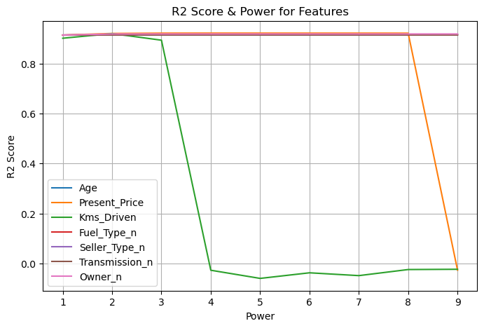

# Regression Model: Improving Model Accuracy through Feature Engineering

This project demonstrates how feature engineering, data scaling, and evaluation metrics can significantly improve the accuracy of regression models.  
The example dataset focuses on car prices, but the same methodology applies to environmental and geospatial datasets such as predicting NDVI from rainfall or modeling land subsidence based on terrain parameters.

---

## Objective
To explore how data preprocessing, feature optimization, and model evaluation affect regression performance and prediction accuracy.

---

## Dataset Overview
The dataset (originally from CarDekho) includes the following features:

- Present_Price — Current ex-showroom price (in lakhs)  
- Kms_Driven — Kilometers driven by the car  
- Fuel_Type — Type of fuel (Petrol/Diesel/CNG)  
- Seller_Type — Type of seller (Dealer/Individual)  
- Transmission — Transmission type (Manual/Automatic)  
- Owner — Number of previous owners  
- Year — Year of manufacturing  
- Selling_Price — Target variable (price at which the car is sold)

A new feature was created:
Age = 2019 - Year  

Irrelevant columns such as Car_Name and Year were removed.

---

## Preprocessing Steps
- Encoding categorical variables using LabelEncoder (Fuel_Type, Seller_Type, Transmission)  
- Feature engineering: creating a new Age column to represent car depreciation  
- Feature scaling: normalizing numeric features using StandardScaler  
- Train/Test split: 80/20 ratio for model evaluation  
- Model fitting: Linear Regression model using scikit-learn

---

## Key Concepts
- Feature Engineering — creating or selecting meaningful variables (e.g., transforming year into car_age)  
- Scaling — normalizing features to improve model convergence  
- Model Evaluation — using MAE, MSE, RMSE, and R² metrics  
- Visualization — comparing predicted vs. actual prices  
- Model Improvement — refining model through feature analysis and data cleaning

---

## Why It Matters
Although this dataset is automotive, the techniques are universally applicable to real-world problems such as:

- Environmental modeling — predicting vegetation index (NDVI) from rainfall  
- Landslide susceptibility — regression between slope, rainfall, and soil type  
- Climate analysis — modeling temperature or air quality trends  

These regression principles form the foundation of GeoAI and Remote Sensing modeling.

---

## Evaluation Example
| Metric | Example Value |
|--------|----------------|
| MAE | 0.58 |
| MSE | 0.54 |
| RMSE | 0.73 |
| R² Score | 0.97 |


---

## Visualization

**1. Relationship Between Features and Target Variable (Selling_Price)**


This figure shows the scatter plots between each independent variable and the target (Selling_Price).  
It helps visualize linear relationships and assess the strength of correlation before training.

**2. Impact of Feature Power on Model Accuracy (R² Score Analysis)**


This figure illustrates how polynomial feature transformations (powers 1–9) affect model performance.  
Higher powers may capture non-linear trends but can also lead to overfitting if extended too far.

---

## Tech Stack
- Python 3.x  
- pandas, numpy  
- scikit-learn  
- matplotlib, seaborn

---

## Run the Notebook
```bash
jupyter notebook "Linear Regression model.ipynb"
```

## Author
Mohamad Rahdan Mofrad
Postdoctoral Researcher – University of Isfahan
🌐 [Kaggle Profile](https://www.kaggle.com/mohammadrahdanmofrad) | [LinkedIn](https://www.linkedin.com/in/mo-rahdan-149554265/)


## License
This project is licensed under the MIT License – see the [LICENSE](LICENSE) file for details.
